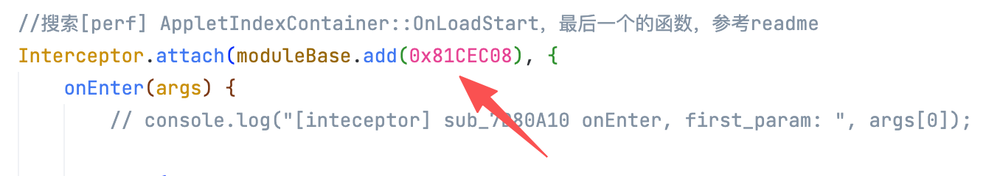
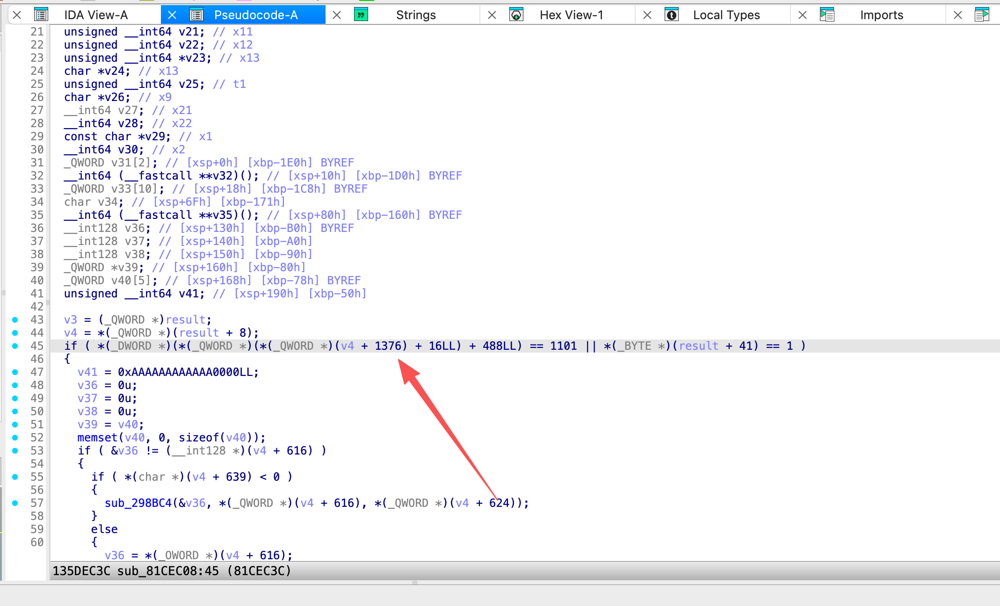
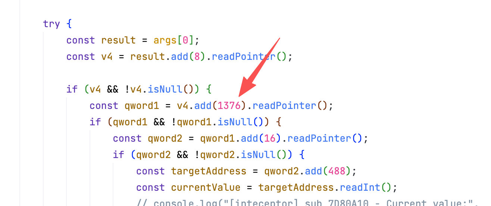

# WMPFDebugger
ida arm打开（时间很久 要等）
```
cd '/Applications/WeChat.app/Contents/MacOS/WeChatAppEx.app/Contents/Frameworks/WeChatAppEx Framework.framework/Versions/C'
```
## 搜索[perf] AppletIndexContainer::OnLoadStart

修改为这个地方的偏移

## 上个函数的最后调用的函数


不通版本这个位置偏移不同


这个值设置为1101


## 搜索SendToClientFilter

这个函数的
```
if ( v8[2] != 6 )
```
这个判断要为true，v8[2]的值不为6

## 搜索WAPCAdapterAppIndex.js
第一个引用

直接返回0x0